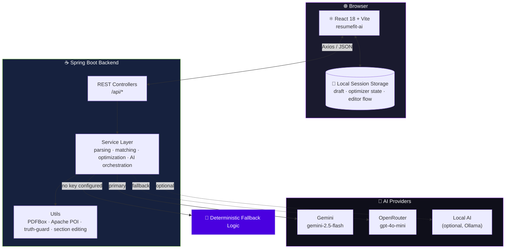
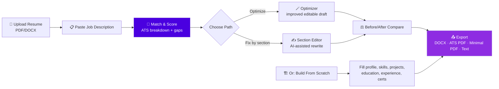

<div align="center">


<br/>

<a href="https://ai-resume-builder-cv-match.netlify.app"></a>
<a href="https://resumefit-ai-backend.onrender.com"></a>

<br/><br/>


</div>

**ResumeFit AI** is a full-stack platform for job seekers who want to compare a resume against a job description, uncover ATS gaps, improve individual sections, build a resume from scratch, and export recruiter-ready files.

Build fresh from structured details — or optimize and rebuild an existing resume, iteratively.

---

## 📌 Table of Contents

- [What It Does](#-what-it-does)
- [Live Links](#-live-links)
- [System Overview](#-system-overview)
- [Core User Journeys](#-core-user-journeys)
- [Project Structure](#-project-structure)
- [Frontend](#-frontend)
- [Backend](#️-backend)
- [API Reference](#-api-reference)
- [CORS Configuration](#-cors-configuration)
- [Common Issues](#-common-issues)
- [Security Notes](#-security-notes)
- [Useful Commands](#-useful-commands)

---

## ✨ What It Does

<table>
<tr><td>📄</td><td><b>Resume Parsing</b></td><td>Upload PDF/DOCX — parsed into clean, structured resume text</td></tr>
<tr><td>🔍</td><td><b>JD Analysis</b></td><td>Extracts keywords, tools, responsibilities, and role signals from any job description</td></tr>
<tr><td>🎯</td><td><b>ATS Matching</b></td><td>Score breakdown, matched/missing keywords, skill gaps, and truth/credibility checks</td></tr>
<tr><td>🪄</td><td><b>Resume Optimizer</b></td><td>Generates an improved, still-editable draft tailored to the target role</td></tr>
<tr><td>✍️</td><td><b>Section Editor</b></td><td>AI-assisted improvement of individual resume sections</td></tr>
<tr><td>🏗️</td><td><b>Resume Builder</b></td><td>Build from scratch — profile, skills, projects, education, experience, certifications, achievements, custom sections</td></tr>
<tr><td>🔀</td><td><b>Reordering</b></td><td>Drag-style reorder for skill groups, sections, projects, and experience entries</td></tr>
<tr><td>⚖️</td><td><b>Before / After View</b></td><td>Compare original vs. optimized draft side-by-side</td></tr>
<tr><td>📤</td><td><b>Multi-Format Export</b></td><td>DOCX · ATS-style PDF · Minimal PDF · Plain text</td></tr>
<tr><td>💾</td><td><b>Session Persistence</b></td><td>Draft, optimizer state, generated resume, and editor flow saved locally in-browser</td></tr>
</table>

---

## 🔗 Live Links

| | |
|---|---|
| 🌍 **Frontend** | [ai-resume-builder-cv-match.netlify.app](https://ai-resume-builder-cv-match.netlify.app) |
| ⚙️ **Backend API** | [resumefit-ai-backend.onrender.com](https://resumefit-ai-backend.onrender.com) |

---

## 🏗 System Overview



---

## 🧭 Core User Journeys



---

## 📁 Project Structure

```text
resume-builder/
├── backend resume builder/          # Spring Boot backend API
│   └── src/main/java/com/resumefit/
│       ├── controller/               # REST controllers
│       ├── dto/                      # Request/response DTOs
│       ├── service/                  # Business logic + AI/fallback services
│       └── util/                     # Parsing, cleaning, section editing, truth guard
│
├── frontend resume builder/
│   └── resumefit-ai/                 # React + Vite frontend
│       └── src/
│           ├── api/                   # Backend API client
│           ├── app/                   # Routes and app context
│           ├── components/            # Layout, preview, optimizer/editor UI, shared UI
│           ├── hooks/                 # Local/session history helpers
│           ├── pages/                 # Landing, dashboard, optimizer, builder, editor...
│           └── utils/                 # Normalizers, export helpers, diff/reorder helpers
│
├── output/                          # Local generated artifacts (not needed for deploy)
└── tmp/                             # Local helper scripts/artifacts (not needed for deploy)
```

---

## ⚛️ Frontend

**Path:** `frontend resume builder/resumefit-ai`
**Stack:** React 18 · Vite 5 · React Router · Axios · Lucide React icons · custom CSS design system (`src/index.css`)

### Setup

```bash
cd "frontend resume builder/resumefit-ai"
npm install
npm run dev          # local dev server
npm run build         # production build → dist/
npm run preview       # preview the production build
```

### Environment

Only needed to override the API URL:

```env
VITE_API_URL=https://resumefit-ai-backend.onrender.com
```

### Deployment (Netlify)

| Setting | Value |
|---|---|
| Build command | `npm run build` |
| Publish directory | `dist` |
| SPA routing | `public/_redirects` → `/* /index.html 200` |

> ⚠️ If the frontend domain changes, update backend CORS (`APP_CORS_ALLOWED_ORIGINS`) **before** testing uploads/API calls in the browser.

---

## ☕️ Backend

**Path:** `backend resume builder`
**Stack:** Java 17 · Spring Boot 3.3.5 · Maven · Lombok · PDFBox (PDF parsing) · Apache POI (DOCX parsing/export) · Dockerfile (Render-ready)

### Setup

```bash
cd "backend resume builder"
./mvnw spring-boot:run         # run locally
./mvnw clean package            # build
```

```powershell
# Windows
.\mvnw.cmd spring-boot:run
.\mvnw.cmd clean package
```

> If `mvnw clean` fails because `target/` is locked, stop any running backend Java process and rerun.

### Environment

```env
SERVER_PORT=8080
APP_CORS_ALLOWED_ORIGINS=https://your-frontend-domain.netlify.app,http://localhost:5173
GEMINI_API_KEY=
GEMINI_MODEL=gemini-2.5-flash
OPENROUTER_API_KEY=
OPENROUTER_MODEL=openai/gpt-4o-mini
LOCAL_AI_ENABLED=false
LOCAL_AI_URL=http://localhost:11434
```

> No AI key configured? Services fall back to **deterministic logic** where implemented — the app degrades gracefully instead of breaking.

### Deployment (Docker / Render)

The included `Dockerfile`: builds with Maven → runs on Java 17 → uses the `prod` Spring profile → reads the port from `PORT` (falls back to `8080`).

Minimum Render environment variables:
```text
APP_CORS_ALLOWED_ORIGINS
GEMINI_API_KEY  (or OPENROUTER_API_KEY)
```

---

## 📡 API Reference

Base path: **`/api`**

<details>
<summary><b>🩺 Health</b></summary>

```http
GET /api/health
```
</details>

<details>
<summary><b>📄 Resume Parsing</b></summary>

```http
POST /api/resume/parse
Content-Type: multipart/form-data
Field: file        # PDF or DOCX only
```
</details>

<details>
<summary><b>🔍 Job Description Analysis</b></summary>

```http
POST /api/job-descriptions/analyze
```
```json
{ "jobDescription": "Full job description text..." }
```
</details>

<details>
<summary><b>🎯 Resume Match</b></summary>

```http
POST /api/resume/match
```
Fields: `resumeText` · `jobDescription` · `skills` · `candidateStage`
</details>

<details>
<summary><b>💡 Resume Suggestions</b></summary>

```http
POST /api/resume/suggestions
```
Same request shape as `/api/resume/match`.
</details>

<details>
<summary><b>🪄 Resume Optimization</b></summary>

```http
POST /api/resume/optimize
```
Fields: `resumeText` · `jobDescription` · `skills` · `roleType` · `candidateStage`
</details>

<details>
<summary><b>🗂️ Resume Versions</b></summary>

```http
POST /api/resume/versions
```
Fields: `resumeText` · `roleType` · `jobDescription` · `skills` · `candidateStage`
</details>

<details>
<summary><b>🏗️ Builder Generation</b></summary>

```http
POST /api/resume/builder/generate
```
Required: `fullName` · `skills` · `roleType` · `candidateLevel`
</details>

<details>
<summary><b>✍️ Section Assist</b></summary>

```http
POST /api/resume/builder/assist-section
```
Required: `sectionType` · `currentContent` · `roleType` · `candidateLevel`
</details>

<details>
<summary><b>📤 Exports</b></summary>

```http
POST /api/resume/export/docx
POST /api/resume/export/pdf/{style}      # style: ats | minimal | template
```
Fields: `resumeText` · `fileName` · `documentTitle` · `templateProfile`
</details>

---

## 🔐 CORS Configuration

The browser can only call the backend if the frontend origin is explicitly allowed.

```text
APP_CORS_ALLOWED_ORIGINS=https://ai-resume-builder-cv-match.netlify.app,http://localhost:5173
```

🔁 **Restart or redeploy the backend** after changing this value.

---

## 🩹 Common Issues

| Symptom | Likely Cause |
|---|---|
| `Cannot reach the backend` | Render backend sleeping/starting · deployment failed · frontend domain missing from `APP_CORS_ALLOWED_ORIGINS` · browser CORS block |
| `Only PDF and DOCX resume files are supported` | TXT uploads aren't supported — use PDF or DOCX |
| `Job description must be between 80 and 12000 characters` | Paste the **full** job description, not just a title |
| `Resume text must be between 80 and 12000 characters` | Parsed text too short/long — scanned/image-only PDFs may have no extractable text |
| `Maven clean fails on target folder` | Stop any running backend Java process, then rerun — Windows may lock `target/` files |

---

## 🔒 Security Notes

- 🚫 Never commit `.env`, `.env.local`, API keys, or provider secrets
- 🚫 Never put real candidate resumes into the repository
- 🔑 Keep AI provider keys in deployment environment variables only
- 🌐 Keep CORS origins limited to trusted frontend domains
- 🛡️ Treat uploaded resumes and job descriptions as user data

---

## 🧰 Useful Commands

<table>
<tr><td valign="top">

**Frontend**
```bash
cd "frontend resume builder/resumefit-ai"
npm install
npm run dev
npm run build
```

</td><td valign="top">

**Backend**
```bash
cd "backend resume builder"
./mvnw spring-boot:run
./mvnw clean package
```

**Windows**
```powershell
cd "backend resume builder"
.\mvnw.cmd spring-boot:run
.\mvnw.cmd clean package
```

</td></tr>
</table>

> `output/` and `tmp/` at the repo root are local helper artifacts (e.g. `tmp/pdfs/generate_sample_resume_pdf.py` for generating a test PDF) — not required for deployment.

---

<div align="center">


</div>
